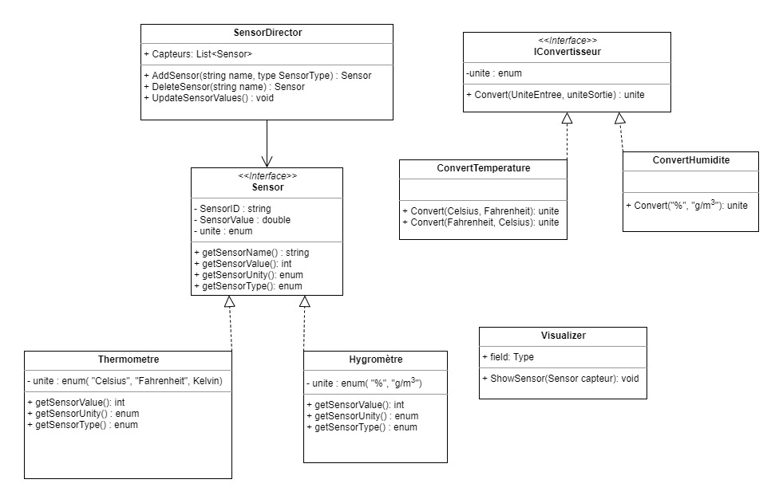

# TP2-DesignPattern
##### Par Théo Marie et Ambre Donnadieu

## Introduction
Ce projet a été fait dans le cadre du cours 8INF956 de l'UQAC. Il est composé de deux exercices :
- le premier consiste à coder un encodeur JSON simple. 
- Le deuxième consiste à faire un gestionnaire de fluxs de données dynamiques 

## Exercice 1 

## Exercice 2 
Pour cet exercice, nous avons fait le diagramme UML suivant :

