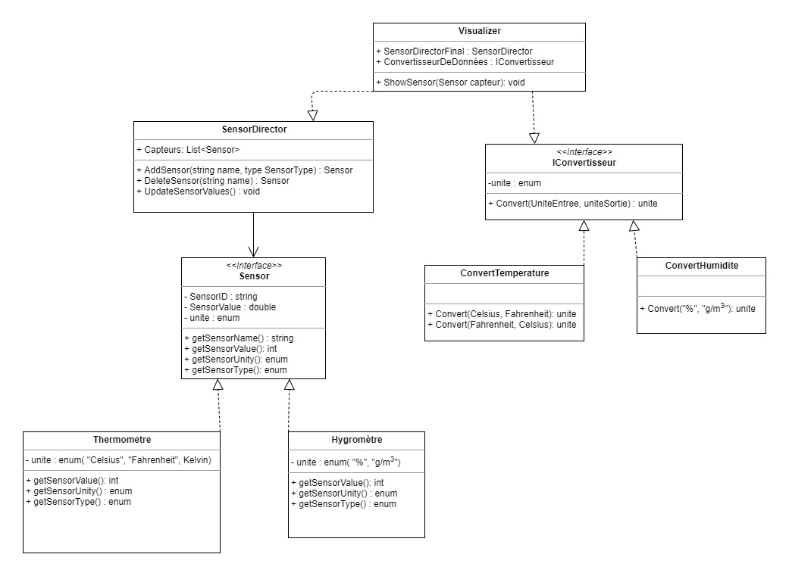

# TP2-DesignPattern
##### Par Théo Marie et Ambre Donnadieu

## Introduction
  Ce projet a été fait dans le cadre du cours 8INF956 de l'UQAC. Il est composé de deux exercices :
- le premier consiste à coder un encodeur JSON simple. 
- Le deuxième consiste à faire un gestionnaire de fluxs de données dynamiques 

## Exercice 1 
  Pour cette partie de l'exercice, nous avons créé une classe "Chat" composée des attribut Nom(string), race(string), yeux(enum CouleurYeux), poil(enum TypePoil et Vaccins(Liste de dates de chaque vaccins).Elle hérite directement de la classe animal, ayant pour seul attribut age(int). Cette classe sert seulement pour tester la partie encodage Json. 
  L'encodage Json a été codé via une nouvelle classe "MyJson", qui hérite directement de la classe Dictionnaire. De cette manière, on peut ajouter notre nouvelle méthode sur la classe déjà existante. Ainsi, MyJson ne contient que cette méthode qui, à partir d'un objet quelconque, va remplir le dictionnaire instantié.

## Exercice 2 
Pour cet exercice, nous avons fait le diagramme UML suivant :

On a donc utilisé le design Pattern Builder pour toute la partie création de capteur et gestion de ceux-ci. Au début, nous sommes partie sur le desing pattern Abstract Factory, pattern qui a ensuite été modifié pour devenir un builder.

Nous avons ensuite ajouté une classe et un interface : Visualiser et IConvertisseur.
Le premier nous permettra de visualiser les données et d'appliquer les potentielles modifications du deuxième sur les données du SensorDirector. L'interface IConvertisseur permet de convertir les valeurs entre les différentes unités de mesure. Le but est que, si l'utilisateur a besoin d'un nouveau type de capteur ou d'une nouvelle convertion, celui-ci n'est qu'à ajouter une classe de conversion pour le type de capteur ajouté. 
